#### 
WorkFeature-WB : 

#### 
Work Feature workbench with parametric objects For FreeCAD   
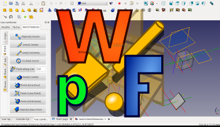
# 
How to create "Center Line Point(s)"

Updated in August 2019
 
 
github : https://github.com/Rentlau/WorkFeature-WB

# Objective

See the usage of the <b>"CenterLinePoint"</b> Button : 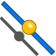

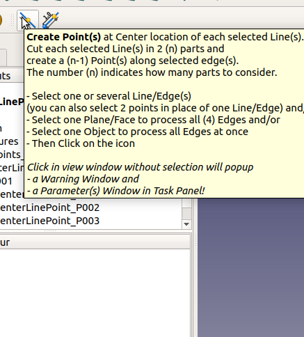

# Summary

| Object(s) Selected                          | Object(s) created  |
|:------|:------|
| **1 Edge**  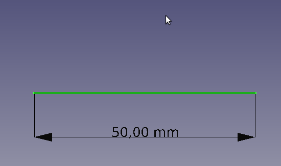| **1 Point** in the middle 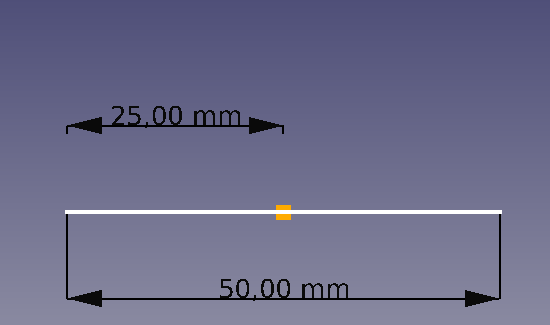|
| **1 Edge**  | **3 Points** 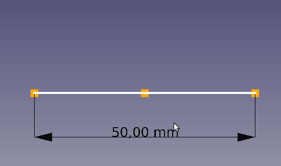|

# How to

A - First open FeeCAD application         | B -Select the FreeCAD File | C - And Select the <b>WorkFeature</b> Workbench 
:-------------------------:|:-------------------------:|:-------------------------:
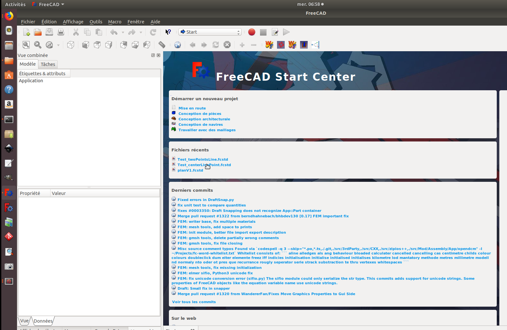 | | 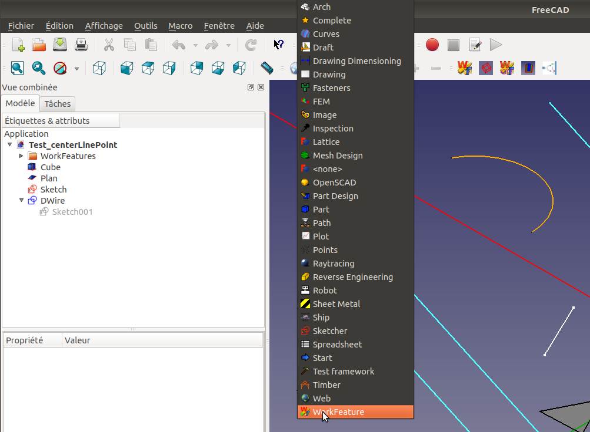

- Click on the **Create Point(s)** button without any object selection will end up 
with a **Macro CenterLinePoint** Popup window message (depending of *Time Out* value 
chosen in General Preference Panel)
and a Parameter window in **Tasks Tab** Panel.
 
In **Tasks Tab** Panel you can define parameters for the **"CenterLinePoint"** function : 
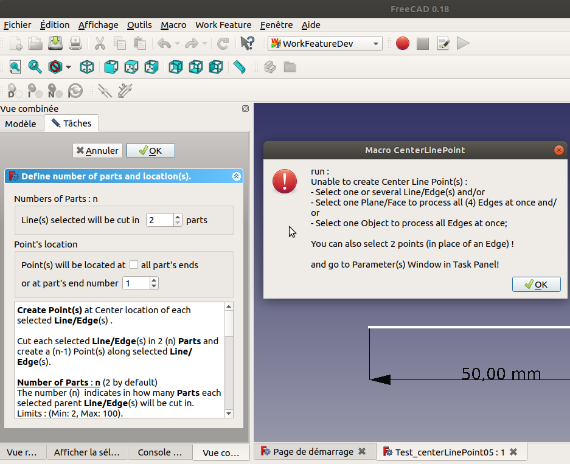

- Click "OK button" on **Macro CenterLinePoint** Popup window message and go to **Tasks Tab** panel to define parameters.  
- Three parameters can be defined : 
    - The <u>**Number of parts**</u>: n (2 by default) 
        The selected line(s) can be cut in 2 parts if you want to get the middle point of the line(s). 
        The number (n) indicates in how many Parts each selected parent Line/Edge(s) will be cut in. 
        Limits : (Min: 2, Max: 100). 
    - **<u>Point's location</u>**:
        - If **Check box** checked then points will be created at each ends of Parts. Even at extrema!
            Ie : if Number of Parts is 3 then 5 points will be created!
        - **Part's end number**
            The number indicates at which part's end the point will be located.
            - If the Number of parts is 2 and Point at part's end 1,
            this means that the point will be located in the middle of the Line.
            1/2 means middle of the segment !
            - If the Number of parts is 2 and Point at part's end 2,
            this means that the point will be located at the end of the Line.
            Note this number can be negative.
            - If the Number of parts is 2 and Point at part's end -1,
            this means that the point will be located before the start of the Line.
             Limits : [-1000:1000]. Negative value are allowed.

         **Check box** and **Part's end number** are exclusive!  

Once defined you can click "OK button" of **Tasks Tab** panel to keep these parameters in memory. 

Note that you need to open again this panel in order to change these parameters in memory.

**To generate points:**
- Select one or several Line/Edge(s)
 (you can also select 2 points in place of one Line/Edge) **and/or**
- Select one Plane/Face to process all (4) Edges **and/or**
- Select one Object to process all Edges at once

- Then Click on the <b>"CenterLinePoint"</b> button.

- And new <b>Point(s)</b> are created under **Model Panel** below the **WorkFeature/WorkPoints_P** group (P means Parametric) : 

A - Parameters        | B - Results | C - Objects
:-------------------------:|:-------------------------:|:-------------------------:
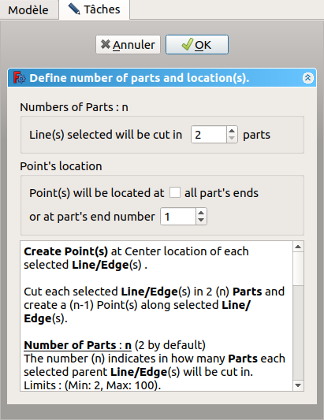| | 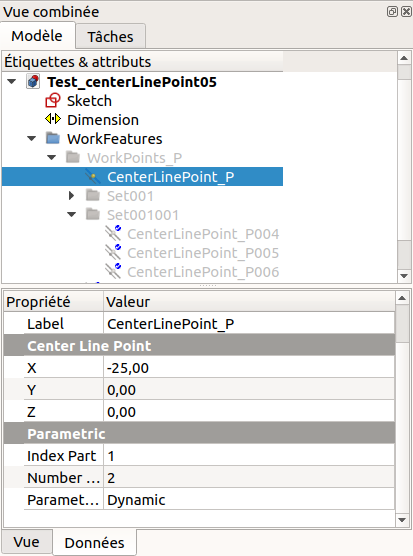
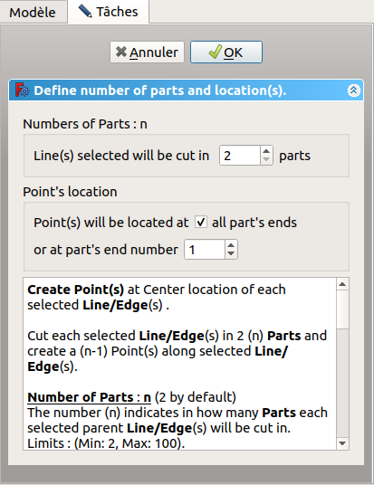| 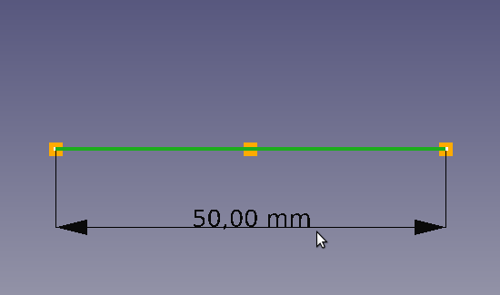| 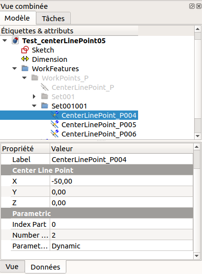
| 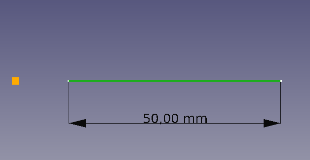| 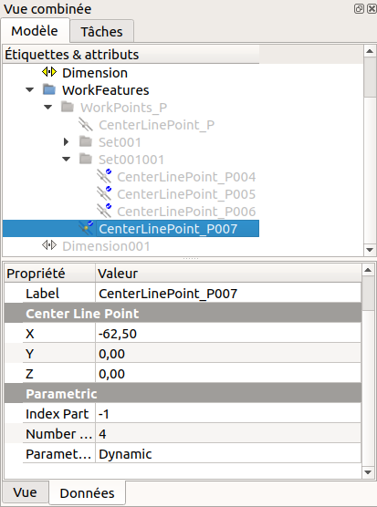

- You can now play with **Parametric** Parameters of the new Point :  
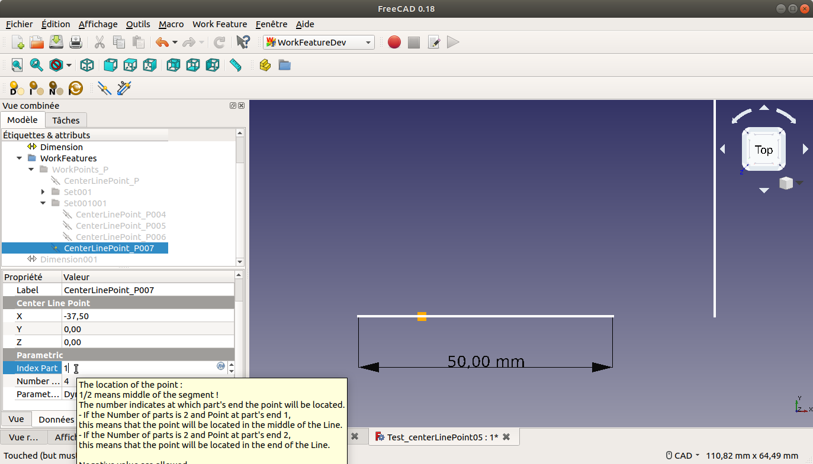
