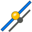
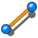

# <center>WorkFeature-WB :<br> </center>
### <center>Work Feature workbench with parametric objects For FreeCAD </center>


<center>by Rentlau_64</center>

Updated in January 2019


[](https://www.python.org/)

# Sections
- [Introduction](#Introduction)
- [Installing](#Installing)
- [Requirements](#Requirements)
- [General purpose](#General-purpose)
- [List of available functions](#List-of-available-functions)
- [Extra Documentations](#Extra-Documentations)
- [License](#License)
- [Releases](#Releases)
- [Associated project](#Associated-project)


##  Introduction

Workbench utility to create:
- Points (Mid points, Extremum points, Center of circle, Center of Plane,),
- Lines (From 2 points,),
- Planes (From 1 point and 1 Line, Perpendicular from 1 point and 1 Line,)
 
 
github : https://github.com/Rentlau/WorkFeature-WB

Post on FreeCAD Forum : https://forum.freecadweb.org/viewtopic.php?f=9&t=27195


<b>Version 2019-01</b> 

[[back to top](#Sections)]

##  Installing


**WorkFeature-WB** is part of the [FreeCAD external workbenches,](https://www.freecadweb.org/wiki/External_workbenches)
 and can be automatically installed using the [FreeCAD Add-on Manager](https://github.com/FreeCAD/FreeCAD-addons) which comes bundled with FreeCAD 0.17, under the *Tools* menu. 

See repository at https://github.com/FreeCAD/FreeCAD-addons for more details on add-ons for FreeCAD.

----------
You can also install manually this workbench by (e.g, on Linux system):
  - Cloning the repository from github (https://github.com/Rentlau/WorkFeature-WB) using:

```
> mkdir /home/your_name/path_to_WorkFeature-WB
> cd /home/your_name/path_to_WorkFeature-WB/
> git clone https://github.com/Rentlau/WorkFeature-WB.git

```

  - *Or download from github the zip file : <b>WorkFeature-WB-master.zip</b> and extract it into "/home/your_name/path_to_WorkFeature-WB"*

  - Then by making a symbolic link into "freecad installation folder"/Mod (most of the time <b>/home/your_name/.FreeCAD/Mod/</b>)<br>
  Into your home directory you must have a similar directory /home/your_name/.FreeCAD/Mod/<br>
  This is the place all your extra workbench add-ons are installed ! :<br>

```
> ln -s /home/your_name/path_to_WorkFeature-WB /home/your_name/.FreeCAD/Mod/
```

  - *Or copy the "/home/your_name/path_to_WorkFeature-WB" directory into into "freecad installation folder"/Mod add-ons directory :<br>*

```
cp /home/your_name/path_to_WorkFeature-WB /home/your_name/.FreeCAD/Mod/
```

On Windows most of the time the place all your extra workbench add-ons are installed is <b>C:\Program Files\FreeCAD 0.16\Mod\WorkeFeature-WB-master</b>.

[[back to top](#Sections)]

## Requirements


- <b>Freecad</b> >= v0.15
- <b>Numpy</b> is a required dependency (numpy >= v1.14.3).

The development of the macro is still currently done with Python2.7 (so this addon is not py3 compatible (yet) and may not work well in FreeCAD >= v0.18).

Please "[Open an issue](https://github.com/Rentlau/WorkFeature-WB/issues)", if you detect any problem.

[[back to top](#Sections)]

## General purpose


**WorkFeature-WB** Tool utility to create **Points** (mid points, center of circle...), **Axes** (from 2 points...), **Planes** (from one axis and a point...) to facilitate the creation of your project. 

The idea behind this python workbench for FreeCAD was to give users some "quick" access tiny tools.

Most of the tools are few "clicks" behavior to give the user quick access to functionalities.

The **workbench** will create into your FreeCAD document a new Group named `WorkFeatures`.<br>
Depending of the tool you will use some objects can be created under the following sub Groups:
- WorkFeatures/
  - WorkPoints_P
  - WorkAxes_P
  - WorkPlanes_P


Quite all **objects** created with **WorkFeature-WB** functions are parametric.

That means; if the **"parent"** object change, all **children WorkFeature-WB** objects will change accordingly !

The **"Parametric"** property of objects can have any of the following behavior regarding parent changes:
- **Not** : For static behavior (No update even if one parents change).
- **Interactive** : Update only when user asks for (click on **`Update`** Button).
- **Dynamic** : Update each time one of parents change.


| Name                           | Icon  |
|:------|:------|
|In General menu click the **`Update`** Button to update all **WorkFeature-WB Interactive** objects |  |

General preferences can be set in `Edit/Preferences` menu.

In this panel you can choose by example to set the **Parametric behavior**:


[[back to top](#Sections)]

## List of available functions


Functions are organised by sub menus:

| Name                           | Icons  |
|:------|:------|
| **WF General** |  |
| **WF Points** |  |
| **WF Lines** |  |

 - WF_General:

| Icon                           | Function  |
|:------|:------|
|  | Hide/Show all **Dynamic** parametric Objects. |
|  | Hide/Show all **Interactive** parametric Objects.|
|  | Hide/Show all **Not** parametric (static) Objects. |
|  | Force  update of all **Interactive** parametric Objects. |

 - WF_Points sub menu :

| Icon                           | Function  |
|:------|:------|
|  | Create Point(s) at Center location of each selected Line(s). <br>Can also create several Points along selected Line(s)|
|  | Create Point(s) along Line(s) <br>at a defined distance of intersection from selected Point(s)/Line(s).|
|  | Create Point(s) at edges of selected Line(s).|
|  | Create Point(s) at center location of selected Circle(s). **<span style="color:red">NOT YET DEV in 2019 release!</span>** |
|  | Create Point(s) at center location of selected Plane(s). **<span style="color:red">NOT YET DEV in 2019 release!</span>**|

- WF_Lines sub menu :

| Icon                           | Function  |
|:------|:------|
|  | Create Line(s) in between two selected Points. |


- WF_Planes sub menu :

| Icon                           | Function  |
|:------|:------|
|  | Create Plane(s) crossing a Point and a Line. **<span style="color:red">NOT YET DEV in 2019 release!</span>**|
|  | Create Planes(s) crossing a Point and perpendicular to a Line. **<span style="color:red">NOT YET DEV in 2019 release!</span>**|

[[back to top](#Sections)]

## Extra Documentations


Find some more detailed documentations in ./Doc directory :
  - [How to create "Center Line Point(s)"](./Doc/CenterLinePoint/HowTo_WFWB_Create_CenterLinePoint.md) <br>

[[back to top](#Sections)]

## License


[GNU GENERAL PUBLIC LICENSE](https://www.gnu.org/licenses/gpl-3.0.html)


[[back to top](#Sections)]

## Releases


[Mars 2018](https://github.com/Rentlau/WorkFeature-WB/tree/V18.03)
First release with only dynamic parametric objects

[January 2019](https://github.com/Rentlau/WorkFeature-WB/tree/release2019_01)
Second release with **Not**, **Interactive** and **Dynamic** parametric objects. Not all Functions available but in active developpement.


[[back to top](#Sections)]

### Associated project

[Work features addon-on (macro) for FreeCAD](https://github.com/Rentlau/WorkFeature)

Tool utility that creates:

    Origin (X, Y Z axes, Origin (0,0,0) point and XZ, XY, YZ planes)
    Points (Center of Mass of object(s), mid points, center of circle, ...),
    Axes (from 2 points, Normal of a plane...),
    Planes (from 3 points, from one axis and a point...)
    and many other useful features to facilitate the creation of your project.


[[back to top](#Sections)]

### Tested on Linux Ubuntu

    A - FreeCAD 0.16.6712 
    B - FreeCAD 0.17.13142


### Tested on Windows

    A - FreeCAD 0.16.6706


