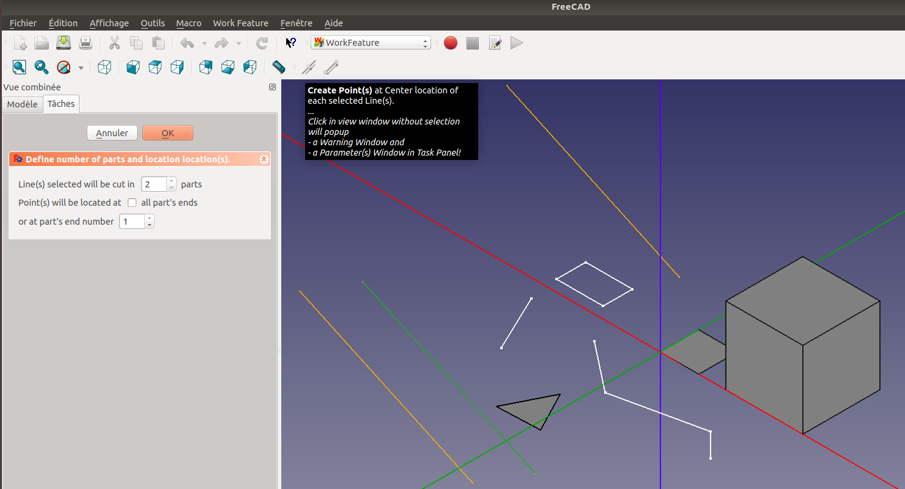

# 
WorkFeature-WB :  

### 
Work Feature workbench with parametric objects For FreeCAD 

----------

Updated in February 2018

Workbench utility to create:
- Points (Mid points, Extremum points),
- Lines (From 2 points,),
 
 
github : https://github.com/Rentlau/WorkFeature-WB

 

 

<b>Version 2018-02</b> 
by Rentlau_64

###  Installing
----------

Download and install FreeCAD from [wiki Download page](http://www.freecadweb.org/wiki/Download) and install this workbench by (e.g, on Linux system): 
  - Cloning the repository from github (https://github.com/Rentlau/WorkFeature-WB) using:

<code>mkdir /home/path_to_WorkFeature-WB/ 
cd /home/path_to_WorkFeature-WB/ 
git clone https://github.com/Rentlau/WorkFeature-WB.git</code>

  - or download from github the zip file : <b>WorkFeature-WB-master.zip</b> and extract it into "/home/path_to_WorkFeature-WB/"

  - Then by making a symbolic link or copy the folder into "freecad installation folder"/Mod (most of the time <b>/home/.FreeCAD/Mod/</b>) :

<code>ln -s (path_to_WorkFeature-WB) (path_to_freecad)/Mod</code>

### Requirements
----------

- <b>FreeCAD</b> : Download and install FreeCAD from [wiki Download page](http://www.freecadweb.org/wiki/Download). 
- <b>python numpy</b> module

The development of the macro is done with Python2.7

### Abstract
----------

Quite all objects created with functions from this workbench are parametric. That mean if the "parent" object change, all children objects will change accordingly !
  

### Documentations
----------

Find some documentation in ./Doc directory :
  - [How to create "Center Line Point(s)"](./Doc/HowTo_WFWB_Create_CenterLinePoint.pdf). 
