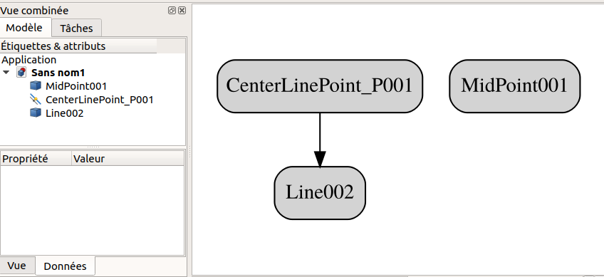
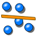

# FreeCAD WorkFeature Workbench 

### Work Feature workbench with parametric objects For FreeCAD

Author: [@Rentlau_64](https://github.com/Rentlau)  
GitHub Repo: https://github.com/Rentlau/WorkFeature-WB  
FreeCAD Forum thread discussion: https://forum.freecadweb.org/viewtopic.php?f=9&t=27195  

**Updated**: March 2019


[](https://www.python.org/)

# Sections
- [Introduction](#Introduction)
- [Installing](#Installing)
- [Requirements](#Requirements)
- [General purpose](#General-purpose)
- [List of available functions](#List-of-available-functions)
- [Extra Documentations](#Extra-Documentations)
- [Releases](#Releases)
- [Associated project](#Associated-project)
- [License](#License)


## Introduction

A FreeCAD Workbench utility to create:
- Points (Mid points, Extremum points, Center of Plane, Projected Point on Plane),
- Lines (From 2 points),
- Planes (From 1 point and 1 Line, From 3 points)


**Version 2019-03-13-dev**

[[back to top](#Sections)]

## Installing  
### FreeCAD Addon Manager
**WorkFeature-WB** is part of the [FreeCAD external workbenches,](https://www.freecadweb.org/wiki/External_workbenches)
 and can be automatically installed using the [FreeCAD Add-on Manager](https://github.com/FreeCAD/FreeCAD-addons) which comes bundled with FreeCAD 0.17, under the *Tools* menu. 

See repository at https://github.com/FreeCAD/FreeCAD-addons for more details on add-ons for FreeCAD.

### Manually Installing 
<details>
  <summary>In general, manual installation is not necessary anymore, but in specific situations it's available. Uncollapse this section to learn more.</summary>
You can also install manually this workbench by (e.g, on Linux system):
  - Cloning the repository from github (https://github.com/Rentlau/WorkFeature-WB) using:

```
> mkdir /home/your_name/path_to_WorkFeature-WB
> cd /home/your_name/path_to_WorkFeature-WB/
> git clone https://github.com/Rentlau/WorkFeature-WB.git

```

  - *Or download from github the zip file : <b>WorkFeature-WB-master.zip</b> and extract it into "/home/your_name/path_to_WorkFeature-WB"*

  - Then by making a symbolic link into "freecad installation folder"/Mod (most of the time <b>/home/your_name/.FreeCAD/Mod/</b>)<br>
  Into your home directory you must have a similar directory /home/your_name/.FreeCAD/Mod/<br>
  This is the place all your extra workbench add-ons are installed ! :<br>

```
> ln -s /home/your_name/path_to_WorkFeature-WB /home/your_name/.FreeCAD/Mod/
```

  - *Or copy the "/home/your_name/path_to_WorkFeature-WB" directory into into "freecad installation folder"/Mod add-ons directory :<br>*

```
cp /home/your_name/path_to_WorkFeature-WB /home/your_name/.FreeCAD/Mod/
```

On Windows most of the time the place all your extra workbench add-ons are installed is <b>C:\Program Files\FreeCAD 0.16\Mod\WorkeFeature-WB-master</b>.
</details>

[[back to top](#Sections)]

## Requirements

- <b>Freecad</b> >= v0.15
- <b>Numpy</b> is a required dependency (numpy >= v1.14.3).

**Important Note:**  
The development of the macro was originally done with Python2.7. The project is now developed under Python 3.6. Therefore this workbench may work fully under FreeCAD v0.18 or higher. Please "[Open an issue](https://github.com/Rentlau/WorkFeature-WB/issues)", if you detect any problems related to py3 compatibility or anything else.

[[back to top](#Sections)]

## General purpose

**WorkFeature-WB** Tool utility to create **Points** (mid points, center of circle...), **Axes** (from 2 points...), **Planes** (from one axis and a point...) to facilitate the creation of your project. 

The idea behind this python workbench for FreeCAD was to give users some "quick" access tiny tools.

Most of the tools available in this workbench require less "clicks" then normal operations, this is intentional behavior to give the user quick access to functionalities.

This **workbench** will create, in your FreeCAD document, a new Group named `WorkFeatures`.  
Depending on the tool you will use, some objects can be created under the following subgroups:  
```
- WorkFeatures/
  - WorkPoints_P
  - WorkAxes_P
  - WorkPlanes_P
```

Most **objects** created with the **WorkFeature-WB** functions are parametric. In other words, if the **"parent"** object changes, all **children WorkFeature-WB** objects will change accordingly!  

The **"Parametric"** property of objects can have any of the following behavior regarding parent changes:  
- **Not** : For static behavior (No update even if one parents change).  
- **Interactive** : Update only when user asks for (click on **`Update`** Button).  
- **Dynamic** : Update each time one of parents change.  

A color code regarding the **"Parametric"** property is used:

| | |
|:------|:------|
|**Not** parametric color |  |
|**Interactive** parametric color |  |
|**Dynamic** parametric color |  |

The **"Parametric"** property can be changed for each single object in it's own **Data** panel:


| Name                           | Icon  |
|:------|:------|
|In General menu click the **`Update`** Button to update all **WorkFeature-WB Interactive** objects |  |

General preferences can be set in `Edit/Preferences` menu.

In this panel you can choose by example to set the **Parametric behavior**:


Hereafter the Graph of relationship shows that the parametric **WorkFeature-WB** Object **CenterLinePoint_P001** is depending on 
**Line002** object, but not the **MidPoint001**!




[[back to top](#Sections)]

## List of available functions

Functions are organised by submenus:

| Name                           | Icons  |
|:------|:------|
| **WF General** |  |
| **WF Points** |  |
| **WF Lines** |  |
| **WF Planes** |  |

### WF_General

| Icon                           | Function  |
|:------|:------|
|  | Hide/Show all **Dynamic** parametric Objects. |
|  | Hide/Show all **Interactive** parametric Objects.|
|  | Hide/Show all **Not** parametric (static) Objects. |
|  | Force  update of all **Interactive** parametric Objects. |

### WF_Points submenu

| Icon                           | Function  |
|:------|:------|
|  | Create Point(s) at Center location of each selected Line(s). <br>Can also create several Points along selected Line(s)|
|  | Create Point(s) at edges of selected Line(s).|
|  | Create Point(s) along Line(s) <br>at a defined distance of intersection from selected Point(s)/Line(s).|
|  | Create a Point at MEAN location of all selected points.|
|  | Create projected point(s) on chosen or main Planes.|
|  | Create Point(s) at center location of selected Circle(s). **<span style="color:red">Unsuppported as of 2019 release</span>** |
|  | Create Point(s) at center of mass location of selected Plane(s). |

### WF_Lines submenu

| Icon                           | Function  |
|:------|:------|
|  | Create Line(s) in between two selected Points. |
|  | Create a "best fit" Line from a set of points using Singular Value Decomposition (SVD). |

### WF_Planes submenu

| Icon                           | Function  |
|:------|:------|
|  | Create a Plane from three selected Points.|
|  | Create Plane(s) crossing a Point and a Line.|
|  | Create Planes(s) crossing a Point and perpendicular to a Line. **<span style="color:red">Unsuppported as of 2019 release</span>**|

[[back to top](#Sections)]

## Extra Documentations

Find some more detailed documentations in the `./Doc` directory:  
* [How to create "Center Line Point(s)"](./Doc/CenterLinePoint/HowTo_WFWB_Create_CenterLinePoint.md)  

[[back to top](#Sections)]

## Releases

[January 2019](https://github.com/Rentlau/WorkFeature-WB/tree/release2019_01)
Second release with **Not**, **Interactive** and **Dynamic** parametric objects. Not all Functions available but in active development.

[March 2018](https://github.com/Rentlau/WorkFeature-WB/tree/V18.03)
First release with only dynamic parametric objects

[[back to top](#Sections)]

### Related projects

[Work features addon-on (macro) for FreeCAD](https://github.com/Rentlau/WorkFeature)
This macro tool utility creates:

    Origin (X, Y Z axes, Origin (0,0,0) point and XZ, XY, YZ planes)
    Points (Center of Mass of object(s), mid points, center of circle, ...),
    Axes (from 2 points, Normal of a plane...),
    Planes (from 3 points, from one axis and a point...)
    and many other useful features to facilitate the creation of your project.

[[back to top](#Sections)]

### Developed on Linux Ubuntu
```
    OS: Ubuntu 18.04.1 LTS
    Word size of OS: 64-bit
    Word size of FreeCAD: 64-bit
    Version: 0.18.15697 (Git)
    Build type: Release
    Branch: master
    Hash: dedaa807629ab25cf32977d30bf7610f1346aff7
    Python version: 2.7.15rc1
    Qt version: 5.9.5
    Coin version: 4.0.0a
    OCC version: 7.3.0
    Locale: French/France (fr_FR)
```
### Tested on Linux Ubuntu

    A - FreeCAD 0.16.6712  : Not Yet
    B - FreeCAD 0.17.13142 : Not yet
    
    C - FreeCAD_0.18.15671_Conda_Py3Qt5_glibc2.12-x86_64.AppImage : ok
    
    OS: Ubuntu 18.04.2 LTS
    Word size of OS: 64-bit
    Word size of FreeCAD: 64-bit
    Version: 0.18.15671 (Git) AppImage
    Build type: Release
    Branch: master
    Hash: 28cbe2bd8986701bb7404842cf60138957e23ed6
    Python version: 3.6.7
    Qt version: 5.6.2
    Coin version: 4.0.0a
    OCC version: 7.3.0
    Locale: French/France (fr_FR)


### Tested on Windows
    A - FreeCAD 0.16.6706 : Not Yet

## License
[](https://www.gnu.org/licenses/gpl-3.0.html)

[[back to top](#Sections)]
